## Taller Principios SOLID y GRASP

Taller realizado bajo un codigo proporcionado por el docente, identificando los problemas de diseño y aplicando los principios SOLID y GRASP para mejorar la calidad del código. Proponiendo una solución más robusta y mantenible de acuerdo a lo visto en clase, presentando diagrama UML y una explicación de los cambios realizados.

### [Ejercicio 1:](https://github.com/juliandhoyos14/EjerciciosPOO/blob/master/src/main/java/org/tallerprincipios/ejercicio1/sinaplicar/Notificador.java) Sistema de Notificaciones

* ¿Qué principio SOLID no se está cumpliendo? ¿Por qué?

⚠️ El sistema anteriormente implementado no cumplía con los principios:

- SRP: La clase hace varias cosas al mismo tiempo, decide que tipo de notifiación enviar y enviaba la notificación por cada uno de los tipos.
- OCP: Cada vez que se quiere agregar un nuevo tipo de notificación, se debe modificar la clase notificación.
- DIP: El notificador depende directamente de los detalles que se tienen en las clases, y no existe una abstracción como lo puede hacer una interfaz.

* ¿Cómo aplicaría el principio Open/Closed para mejorar este diseño?

💡 Para lograr tener una mejor estructura en el codigo, y evitar dependencias directas, se crea una interfaz notificación y las clases que lo implementan según este mismo.

Ubicación: `src/Ejercicio1/`

### [Ejercicio 2:](https://github.com/juliandhoyos14/EjerciciosPOO/tree/master/src/main/java/org/tallerprincipios/ejercicio2/sinaplicar) Gestión de Empleados

* ¿Qué principio GRASP prodría aplicarse aquí para mejorarse el diseño?

💡 El principio aplicado fue el polimorfismo, ya que nos permite crear una clase padre para asignar los comportamientos a las subclases que pueden ser implementadas, permitiendo en un futuro agregar más tipos de empleados.

* ¿Comó se relaciona esta solución con el principio Liskov Substitution?

❓ La relación es que al implementar una clase abstracta o clase padre, se supone que al modificar algún tipo de empleado en específico no tendría porque alterar cualquiera de las otras subclases o la clase padre del código.

Ubicación: `src/Ejercicio2/`

### [Ejercicio 3:](https://github.com/juliandhoyos14/EjerciciosPOO/tree/master/src/main/java/org/tallerprincipios/ejercicio3/sinaplicar) El trabajador todero

* ¿Qué problemas ve en el diseño original?

⚠️ El trabajador todero tiene muchas responsabilidades diferentes en una misma clase, lo que no permite tener una unica resposabilidad por clase y mucho menos un propósito claro, objetivamente si se busca agregar más trabajos para este trabajador todero, llegaría a ser complejo de mantener.

* Proponer una solución aplicando el principio de responsabilidad única (SRP) y high cohesion.

💡 Dividir cada trabajo por clase, actualmente solo tiene una función pero si se busca que cada trabajo tengan más funcionalidades o tener más de estos trabajos iniciales, será mucho más fácil de mantener.

Ubicación: `src/Ejercicio3/`

### [Ejercicio 4:](https://github.com/juliandhoyos14/EjerciciosPOO/tree/master/src/main/java/org/tallerprincipios/ejercicio4/sinaplicar) Sistema de Archivos

* Identifique por qué en este diseño se violan los principios SOLID DIP (Principio de Inversión de Dependencias) y OCP (Principio Open / Closed)

❓ Se violan los principios porque cada que se quiere agregar un nuevo tipo de archivo se debe modificar directamente la clase de gestor de archivos, generando más if's anidados. 
Agregando que todo depende de un solo archivo que es la clase gestor de archivos.

* Qué otros principios crees que no se están aplicando

⚠️ SRP: Ya que como se había dicho anteriormente, la clase gestor de archivos tiene toda la responsabilidad para cualquier tipo de archivo.

* Proponga una solución basada en interfaces aplicando los principios DIP y OCP

💡 Crear una interfaz de Gestor de Archivos con las funcionalidades generales, y crear una clase para cada tipo de archivo que se vaya a manipular.

Ubicación: `src/Ejercicio4/`

### [Ejercicio 5:](https://github.com/juliandhoyos14/EjerciciosPOO/tree/master/src/main/java/org/tallerprincipios/ejercicio5/sinaplicar) Dispositivos 

* ¿Qué problemas visualiza en el diseño original?

⚠️ Se tiene una interfaz de dispositivos que tiene métodos que no todos los dispositivos no pueden implementar, como por ejemplo un reproductor mp3 no puede reproducir videos, lo cual en este código se permite, o un mp4 (reproductor de video) no puede reproducir audio solamente.

* Proponga una solución aplicando el principio de Segregación de Interfaces (ISP)

💡 Se crean 3 interfaces más específicas todavía, una para dispositivos, y otra para reproductores de audio y otra para video, después se agregan las clases de los dispositivos que implementen la clase dispositivo y su interfaz específica.

Ubicación: `src/Ejercicio5/`

### [Ejercicio 6:](https://github.com/juliandhoyos14/EjerciciosPOO/tree/master/src/main/java/org/tallerprincipios/ejercicio6/sinaplicar) Pedidos

* ¿Qué problemas visualiza en el diseño actual?

⚠️ El controlador tiene la responsabilidad de calcular el total del pedido, lo cual no le corresponde ya que debe coordinar la lógica entre clases más no las reglas del negocio.

* ¿Qué clase debería tener la responsabilidad de calcular el total?

❓ La clase pedido es la que debería de tener la responsabilidad de calcular dicho total, ya que es la que tiene toda la información necesaria para realizarlo.

* ¿Qué principios GRASP o SOLID aplicaría para mejorar el diseño?

💡 Principios Utilizados:
- Information Expert: La clase Pedido tiene la información necesaria para calcular el total.
- SRP: Cada clase tiene una única responsabilidad.
- High Cohesion: Pedido es el que debe mantener la lógica de negocio relacionada con los pedidos.
- Low Coupling: El controlador solo coordina las acciones de las clases sin involucrarse en la lógica de negocio.

Ubicación: `src/Ejercicio6/`

### [Ejercicio 7:](https://github.com/juliandhoyos14/EjerciciosPOO/tree/master/src/main/java/org/tallerprincipios/ejercicio7/sinaplicar) Reservas

* Identifique 3 problemas en el diseño del código

⚠️ Problemas identificados:
1. La clase `Reserva` tiene múltiples responsabilidades (SRP).
2. Depende directamente de `DatabaseManager` y `EmailService`, violando **DIP**.
3. No hay una capa de control clara que organice la lógica de negocio.

* ¿Cómo podría usarse el principio Controller de GRASP en este problema?

❓ Se podría usar un controlador que simplemente maneje las solicitudes de reserva utilizando las clases especializadas para agregar a la base de datos, enviar una notificación.

* Aplique el principio de Inversión de Dependencias para mejorar el código

💡 Se agrega un repositorio con las funcionalidades de la reserva en este caso guardar, que la implementa DatabaseManager, y llamarlo desde el controlador.
También se agrega un servicio de notificaciones en caso de que se quiera tener varias maneras de notificar, que lo implementa la notificación de email.

El objetivo es que reserva no dependa de detalles concretos, sino de abstracciones.

Ubicación: `src/Ejercicio7/`

### [Ejercicio 8:](https://github.com/juliandhoyos14/EjerciciosPOO/tree/master/src/main/java/org/tallerprincipios/ejercicio8/sinaplicar) Sistema de Logging

* ¿Qué principio GRASP podría usarse para reducir el acoplamiento?

💡 Se podría usar Polimorfismo y el principio Dependency Inversion creando una interfaz `Logger` con los métodos `debug()` y `error()`. 
Para permitir que Service utilice cualquier implementación de logger sin depender de detalles concretos, que aunque de momento solo tenemos loggers especificos como database, file y console, pueden ser más o pueden tener funcionalidades diferentes según la necesidad.

Ubicación: `src/Ejercicio8/`

### **_Mapa Mental GRASP, SOLID, YAGNI, KISS, LoD y DRY_**

Ubicación: `src/resources/MapaMental.svg`

